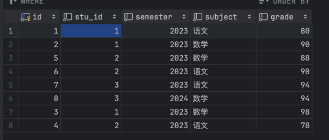
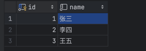

# SQL SOLUTIONS BREAKDOWN

## Breaking down an SQL query into parts can help you understand and analyze it more effectively. Here's a general approach you can follow:

## Understand the Objective: Begin by understanding the purpose of the query. What are you trying to achieve? What information are you looking to retrieve or manipulate?

## Identify the SELECT Statement: Look for the SELECT keyword, which indicates the columns you want to retrieve. Understand which columns are being selected and if any calculations or functions are applied to them.

## Find the FROM Clause: Look for the FROM keyword, which specifies the tables involved in the query. Understand how the tables are related or joined together.

## Analyze the JOINs: If there are any joins (e.g., INNER JOIN, LEFT JOIN), understand how they connect the tables. Identify the columns used for joining and the type of join being used.

## Look for the WHERE Clause: If present, the WHERE clause filters the rows returned by the query. Identify the conditions used to filter the data.

## Check for GROUP BY and HAVING Clauses: If the query involves grouping or aggregating data, there may be a GROUP BY clause followed by an optional HAVING clause. Understand how the data is grouped and any conditions applied to the groups.

## Review the ORDER BY Clause: The ORDER BY clause, if present, specifies the order in which the results are returned. Understand the columns used for sorting and the sort order (ascending or descending).

## Consider Subqueries: If the query contains subqueries (queries within the main query), understand their purpose and how they contribute to the overall result.

## Break Down the SELECT Expression: If the SELECT expression is complex (e.g., using functions, aliases), break it down into simpler parts to understand each component's role.

## Understand the Result Set: Finally, visualize the result set that the query will produce. Imagine what the data will look like based on the query's logic.

## SQL INTERVIEW QUESTIONS

### to find the student's highest score in every subject and different semester,

```sql
SELECT b.name AS studentname, a.subject, MAX(a.grade) AS highest_grade
FROM score a
         LEFT JOIN student b ON a.stu_id = b.id
GROUP BY b.name, a.subject
ORDER BY b.name, a.subject, highest_grade DESC;
```


